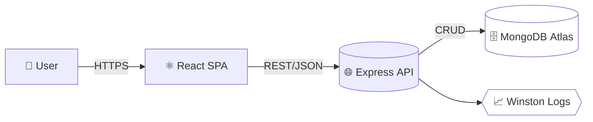
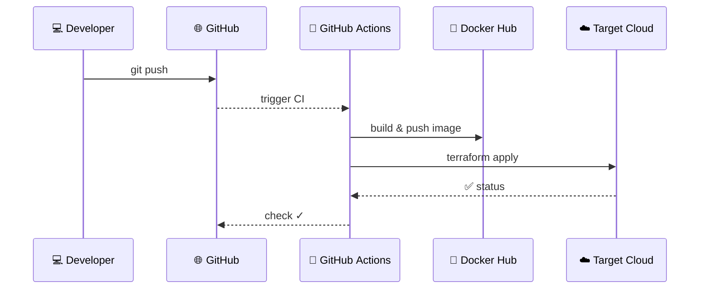

# Pokémon with Mongo 🟥🟦🟩

    

A full‑stack demo app that lets you **catch, list and trade** Pokémon while storing all data in **MongoDB Atlas**.  Everything ships in reproducible Docker containers and can be provisioned end‑to‑end on any cloud (or your laptop) with **Terraform**.  Perfect for practicing
modern DevOps & backend skills on a fun dataset ⚡️

---

## ✨ Features

| Icon | Feature | Why it matters |
| :---: | --- | --- |
| 🎲 | Pokémon API `/api/pokemon` | Learn REST conventions with a familiar domain |
| 🗄️ | MongoDB 6 + Mongoose ODM | Schema validation + flexible documents |
| 🐳 | Docker & docker‑compose | One‑line local sandbox & reproducible CI builds |
| 🛰️ | Terraform IaC modules | Zero‑click cloud deployment & teardown |
| 🔐 | JWT Auth + role‑based routes | Secure multi‑user trading & admin console |
| 🧪 | Jest + Supertest | Green tests → safer refactors |

---

## 🗺️ High‑level Architecture



\### CI / CD Pipeline



> **Tip 🧑‍🏫** Don’t need cloud?  Run *everything* locally with `docker compose up --build`.

---

## 🚀 Quick start

```bash
# clone
$ git clone https://github.com/your‑org/pokemon‑with‑mongo.git
$ cd pokemon‑with‑mongo

# create .env
$ cp .env.example .env
# ⇢ add your MongoDB URI & JWT secret

# launch stack
$ docker compose up --build

# visit
➡️ http://localhost:5173           # frontend (Vite)
➡️ http://localhost:3000/api/docs  # Swagger UI
```

\### Terraform (deploy to AWS in ⏱️ 5 minutes)

```bash
# inside /iac folder
$ terraform init
$ terraform apply -auto-approve

# Outputs
🌍 API URL : https://api.example.com
🌍 Web URL : https://app.example.com
```

Destroy when done:

```bash
terraform destroy -auto-approve
```

---

## ⚙️ Project Structure

```
├── frontend/           # React + Vite client
├── server/             # Express API + Mongoose models
├── docker/             # Dockerfiles & compose
├── iac/                # Terraform modules
└── tests/              # Jest & integration specs
```

---

## 📑 API Reference

| Method | Endpoint | Description |
| --- | --- | --- |
| GET | `/api/pokemon` | List Pokémon |
| POST | `/api/pokemon` | Create new Pokémon |
| PUT | `/api/pokemon/:id` | Update Pokémon |
| DELETE | `/api/pokemon/:id` | Release Pokémon |
| POST | `/api/auth/login` | User login |

Full Swagger / OpenAPI docs live at **`/api/docs`**.

---

## 🛠️ Tech Stack

* **Frontend:** React 18 · TypeScript · Vite · TailwindCSS
* **Backend:** Node 18 · Express · Mongoose · JWT · Swagger
* **Database:** MongoDB Atlas (serverless tier)
* **CI / CD:** GitHub Actions · Docker · Terraform · AWS (ECS + Fargate)
* **Observability:** Winston logs → CloudWatch · Healthcheck endpoint `/health`

---

## 🧑‍💻 Contributing 

1. Fork the repo 🍴
2. Create your feature branch `git checkout -b feat/amazing‑feature`
3. Commit changes `git commit -m "add amazing feature"`
4. Push to the branch `git push origin feat/amazing‑feature`
5. Open a pull request 💌

---

## 📜 License

Distributed under the **MIT License**.  See `LICENSE` for more info.

> Pokémon © 1995‑2025 Nintendo / Game Freak.  This project is a fan‑made, non‑commercial demo.
